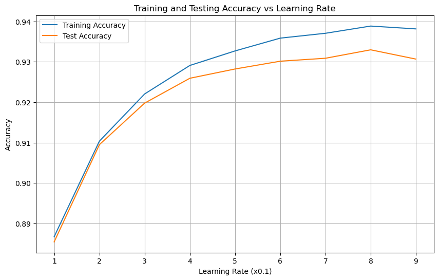
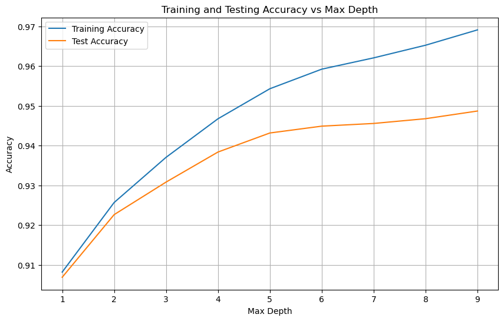

# Phishing URL Detection using Gradient Boosting Classifier

This project aims to detect phishing URLs using a Gradient Boosting Classifier (GBC) model trained on the Phishing URL Dataset from the UCI Machine Learning Repository.

## Dataset

The dataset used in this project is the Phishing URL Dataset, which can be downloaded from the UCI Machine Learning Repository: [Phishing URL Dataset](https://archive.ics.uci.edu/dataset/967/phiusiil%2Bphishing%2Burl%2Bdataset).

The dataset contains 11,055 instances and 30 attributes, including the URL and its phishing status (legitimate or phishing).

## Model Performance

The Gradient Boosting Classifier achieved the following performance metrics on the test set:

- **Accuracy**: 0.938
- **F1-score**: 0.938
- **Recall**: 0.938
- **Precision**: 0.938

The classification report shows the performance for each class:

          precision    recall  f1-score   support
     0.0       0.94      0.93      0.94      9584
     1.0       0.93      0.94      0.94      9599
accuracy                           0.94     19183

## Hyperparameter Tuning

The model's performance was evaluated by tuning the learning rate and max depth hyperparameters. The results are shown in the following plots:

1. **Training and Testing Accuracy vs Learning Rate**
   

2. **Training and Testing Accuracy vs Max Depth**
   

The plots show that the model's accuracy increases with higher learning rates and max depths, but there is a point where the test accuracy starts to decrease due to overfitting. 

**Note**: The results may still vary based on the specific dataset and its characteristics. Further fine-tuning of hyperparameters may be necessary to achieve optimal performance for different scenarios.

